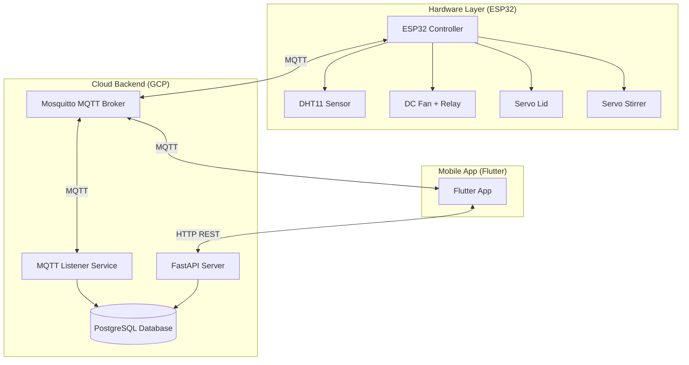
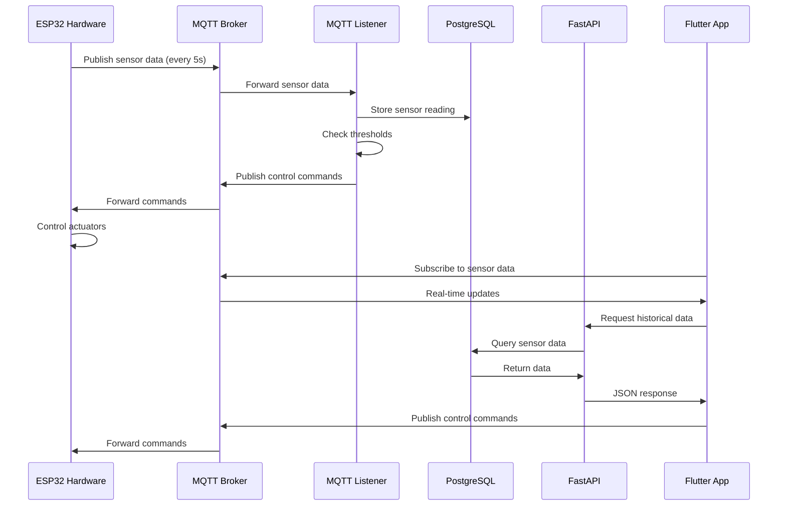

# IoT Compost Monitoring System

A comprehensive IoT solution for monitoring and controlling compost batches with real-time sensor data, automated control logic, and mobile app interface.

## Project Overview

This system enables automated monitoring and control of compost batches through a three-tier architecture:

1. **Hardware Layer** - ESP32-based edge device with sensors and actuators
2. **Cloud Backend** - GCP server with MQTT broker, database, and REST API
3. **Mobile Application** - Flutter app for real-time monitoring and control

The system automatically maintains optimal composting conditions (temperature: 55-65°C, humidity: 50-60%) through intelligent control of fans, lids, and stirrers, while providing historical analytics and batch management capabilities.

## Repository Structure

```
Project_app/
├── hardware/              # ESP32 Arduino firmware
│   ├── main.ino          # Main firmware code
│   ├── README.md         # Hardware module documentation
│
├── cloud/                # GCP server backend
│   ├── main.py           # FastAPI application
│   ├── mqtt_listener.py  # MQTT listener service
│   ├── compost_calculations.py  # Control logic calculations
│   ├── config.py         # Configuration settings
│   ├── requirements.txt  # Python dependencies
│   ├── migrations/       # Database migration scripts
│   ├── systemd/          # Systemd service files
│   ├── README.md         # Cloud module documentation
│   ├── SETUP.md          # Cloud setup guide
│   ├── API_DOCS.md       # API endpoint documentation
│   └── SYSTEMD_SETUP.md  # Systemd service setup guide
│
└── compost_monitor_app/  # Flutter mobile application
    ├── lib/              # Dart source code
    ├── android/          # Android-specific files
    ├── pubspec.yaml      # Flutter dependencies
    ├── README.md         # App module documentation
    └── SETUP.md          # App setup guide
```

## Architecture

### System Components



### Data Flow



## Technology Stack

### Hardware
- **Microcontroller**: ESP32 (Wi-Fi enabled)
- **Sensor**: DHT11 (Temperature & Humidity)
- **Actuators**: Servo motors (lid, stirrer), Relay module (fan)
- **Communication**: MQTT over Wi-Fi

### Backend
- **Language**: Python 3.x
- **Framework**: FastAPI
- **Database**: PostgreSQL
- **MQTT Broker**: Eclipse Mosquitto
- **Deployment**: GCP Compute Engine (Ubuntu/Debian)
- **Service Management**: systemd

### Mobile App
- **Framework**: Flutter (Dart)
- **State Management**: Provider
- **Charts**: fl_chart
- **MQTT Client**: mqtt_client
- **HTTP Client**: http

## Quick Start

### Prerequisites

- **Hardware**: ESP32, DHT11 sensor, servos, relay module
- **Cloud**: GCP Compute Engine instance with Ubuntu/Debian
- **Mobile**: Flutter SDK 3.0.0+ installed
- **Network**: Wi-Fi network accessible to ESP32 and mobile device

### Setup Steps

1. **Hardware Setup**
   - See [hardware/SETUP.md](hardware/SETUP.md) for wiring and firmware upload

2. **Cloud Backend Setup**
   - See [cloud/SETUP.md](cloud/SETUP.md) for server installation and configuration

3. **Mobile App Setup**
   - See [compost_monitor_app/SETUP.md](compost_monitor_app/SETUP.md) for Flutter app setup

## Module Documentation

### Hardware Module
- **Purpose**: ESP32 firmware for sensor reading and actuator control
- **Documentation**: [hardware/README.md](hardware/README.md)
- **Setup Guide**: [hardware/SETUP.md](hardware/SETUP.md)

### Cloud Backend Module
- **Purpose**: GCP server backend for data processing, storage, and API
- **Documentation**: [cloud/README.md](cloud/README.md)
- **Setup Guide**: [cloud/SETUP.md](cloud/SETUP.md)
- **API Documentation**: [cloud/API_DOCS.md](cloud/API_DOCS.md)
- **Deployment Guide**: [cloud/SYSTEMD_SETUP.md](cloud/SYSTEMD_SETUP.md)

### Mobile App Module
- **Purpose**: Flutter mobile application for monitoring and control
- **Documentation**: [compost_monitor_app/README.md](compost_monitor_app/README.md)
- **Setup Guide**: [compost_monitor_app/SETUP.md](compost_monitor_app/SETUP.md)

## Key Features

### Automated Control
- **Temperature Control**: Maintains optimal range (55-65°C) through fan and lid control
- **Humidity Control**: Maintains optimal range (50-60%) through fan control
- **Priority Logic**: Temperature control takes priority over humidity
- **Emergency Response**: Critical thresholds trigger immediate actions

### Real-Time Monitoring
- Live sensor data via MQTT (low latency)
- Visual gauges for temperature and humidity
- Device status indicators (fan, lid, stirrer)

### Historical Analytics
- Temperature and humidity charts (1, 7, 30 days)
- Compost completion status calculation
- Batch progress tracking

### Batch Management
- Create and manage compost batches
- Track batch lifecycle (planning, active, completed)
- C:N ratio calculations for waste input optimization

## MQTT Topics

### Sensor Data
- **Topic**: `compost/sensor/data`
- **Publisher**: ESP32
- **Subscribers**: MQTT Listener, Flutter App
- **Format**: JSON with temperature, humidity, timestamp, device status

### Control Commands
- **Topics**: 
  - `compost/cmd/fan` - Fan control (ON/OFF)
  - `compost/cmd/lid` - Lid control (OPEN/CLOSED)
  - `compost/cmd/stirrer` - Stirrer control (ON/OFF)
- **Publishers**: MQTT Listener (automated), Flutter App (manual)
- **Subscriber**: ESP32

### Status Feedback
- **Topics**:
  - `compost/status/fan` - Fan status confirmation
  - `compost/status/lid` - Lid status confirmation
  - `compost/status/stirrer` - Stirrer status confirmation
- **Publisher**: ESP32
- **Subscriber**: Flutter App

## Configuration

### Hardware Configuration
- WiFi credentials (SSID, password)
- MQTT broker IP address
- Pin assignments (see hardware/SETUP.md)

### Cloud Configuration
- Database connection (PostgreSQL)
- MQTT broker settings
- Control thresholds (temperature, humidity)
- API host and port

### App Configuration
- MQTT broker URL
- API base URL
- Can be configured in-app via Settings screen

## Troubleshooting

### Hardware Issues
- See [hardware/SETUP.md](hardware/SETUP.md) troubleshooting section

### Backend Issues
- See [cloud/SETUP.md](cloud/SETUP.md) troubleshooting section
- Check systemd service logs: `sudo journalctl -u compost-mqtt-listener.service -f`

### App Issues
- See [compost_monitor_app/SETUP.md](compost_monitor_app/SETUP.md) troubleshooting section

## License

This project is developed for educational purposes as part of CPC357 IoT Architecture and Smart Applications course.

## Contributing

This is a course project. For questions or issues, please contact the development team.

